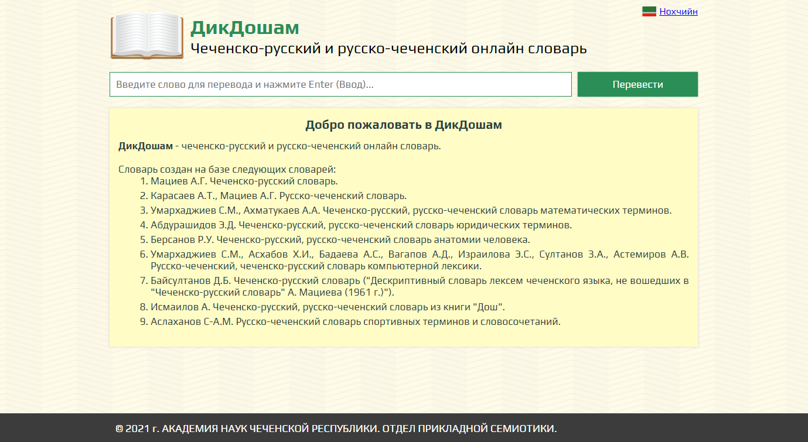
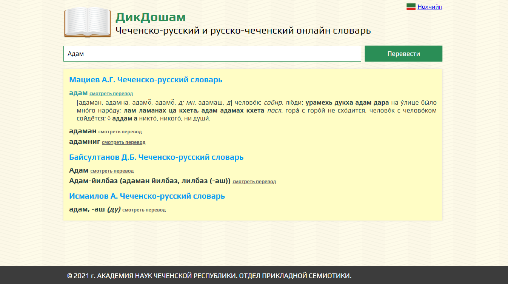

# Dikdosham
Чеченско-русский и русско-чеченский онлайн словарь.
Словарь создан на базе следующих словарей:

1. Мациев А.Г. Чеченско-русский словарь.
2. Карасаев А.Т., Мациев А.Г. Русско-чеченский словарь.
3. Умархаджиев С.М., Ахматукаев А.А. Чеченско-русский, русско-чеченский словарь математических терминов.
4. Абдурашидов Э.Д. Чеченско-русский, русско-чеченский словарь юридических терминов.
5. Берсанов Р.У. Чеченско-русский, русско-чеченский словарь анатомии человека.
6. Умархаджиев С.М., Асхабов Х.И., Бадаева А.С., Вагапов А.Д., Израилова Э.С., Султанов З.А., Астемиров А.В. Русско-чеченский, чеченско-русский словарь компьютерной лексики.
7. Байсултанов Д.Б. Чеченско-русский словарь ("Дескриптивный словарь лексем чеченского языка, не вошедших в "Чеченско-русский словарь" А. Мациева (1961 г.)").
8. Исмаилов А. Чеченско-русский, русско-чеченский словарь из книги "Дош".
9. Аслаханов С-А.М. Русско-чеченский словарь спортивных терминов и словосочетаний.

## Сайт
https://ps95.ru/dikdosham/ru/

## Начальная страница

## Страница с переводом слова

